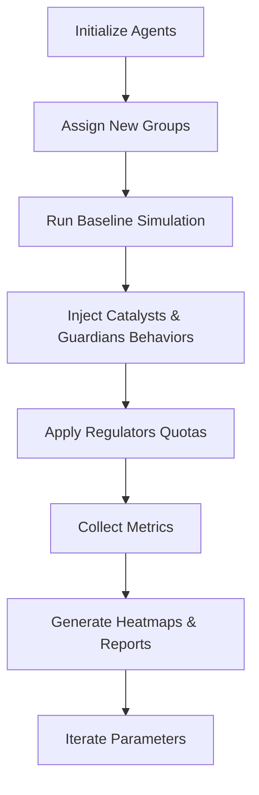

# Next Simulation Round Specification

**Purpose**: Extend the existing 10 000‑agent collaboration simulation to explore emergent behaviors under new constraints and enriched dynamics.

---

## 1. Background Data (10 000‑agent baseline)

- **Population**: 10 000 agents distributed across 5 archetype groups (Innovators, Early‑Adopters, Mainstream, Late‑Adopters, Dissenters).
- **Traffic Patterns**: Average daily message count 1.2 M, peak concurrency 8 k active agents, network latency 45 ms (simulated).
- **Idea Distribution**: 65 % of ideas originated from Innovators & Early‑Adopters, 30 % from Mainstream, 5 % from Dissenters. Idea adoption curve follows an S‑shape with a half‑life of ~2.5 days.

---

## 2. New Agent Groups

| Group | Description | Size (agents) | Behavioral Traits |
|-------|-------------|---------------|-------------------|
| **Catalysts** | Agents that purposefully amplify high‑impact ideas. | 800 | Boost outgoing message rate by 1.5× for ideas with adoption >30 %.
| **Guardians** | Agents that monitor misinformation and suppress low‑quality signals. | 600 | Reduce propagation of ideas rated <0.2 quality score.
| **Explorers** | Agents that seek novel idea spaces outside the current topic graph. | 500 | Introduce random idea seeds every 12 h.
| **Collaborators** | Agents that form temporary teams to co‑create composite ideas. | 700 | Share resources, generate joint ideas with combined quality boost.
| **Regulators** | Agents that enforce resource limits (e.g., bandwidth caps). | 400 | Impose per‑agent message quota when network load >70 %.

*The remaining 7 500 agents retain their original archetype roles.*

---

## 3. Additional Metrics

1. **Idea Impact Score (IIS)** – weighted sum of reach, adoption speed, and quality.
2. **Network Resilience Index (NRI)** – ability of the system to maintain >80 % connectivity under simulated failures.
3. **Collaboration Efficiency (CE)** – ratio of joint‑idea output to total messages among Collaborators.
4. **Misinformation Containment Ratio (MCR)** – proportion of low‑quality ideas successfully suppressed by Guardians.
5. **Resource Utilization Heatmap** – per‑agent bandwidth and processing usage over time.

---

## 4. Pipeline Changes

- **Step B**: Randomly assign 3 % of the total population to the new groups while preserving original archetype distribution.
- **Step D**: Introduce event‑driven callbacks for Catalysts and Guardians.
- **Step E**: Regulators monitor global traffic; when threshold crossed, they dynamically throttle agents.
- **Step F**: Extended logging to capture IIS, NRI, CE, MCR.
- **Step H**: Parameter sweep over Catalyst amplification factor (1.2‑2.0) and Guardian suppression threshold (0.1‑0.3).

---

## 5. Experiment Plan

| Run | Catalyst Factor | Guardian Threshold | Regulator Policy |
|-----|-----------------|--------------------|------------------|
| 1 | 1.3 | 0.2 | Soft cap (90 % load) |
| 2 | 1.5 | 0.15 | Hard cap (80 % load) |
| 3 | 1.8 | 0.25 | Adaptive cap (dynamic) |

Each run lasts 30 days simulated time, recorded with a 5‑minute sampling interval.

---

## 6. Deliverables

- Updated simulation code repository under `demo_site/sim/`.
- `next_round_spec.md` (this document) stored as an artifact.
- Automated report generator producing CSVs for the new metrics.
- Visualization dashboard (optional) rendering the heatmaps.

---

**Next Steps**
1. Review the specification and confirm group sizes/parameters.
2. Approve creation of the new simulation modules.
3. Schedule the first run (Run 1) on the simulation platform.

---

*Prepared by the simulation sub‑agent.*
